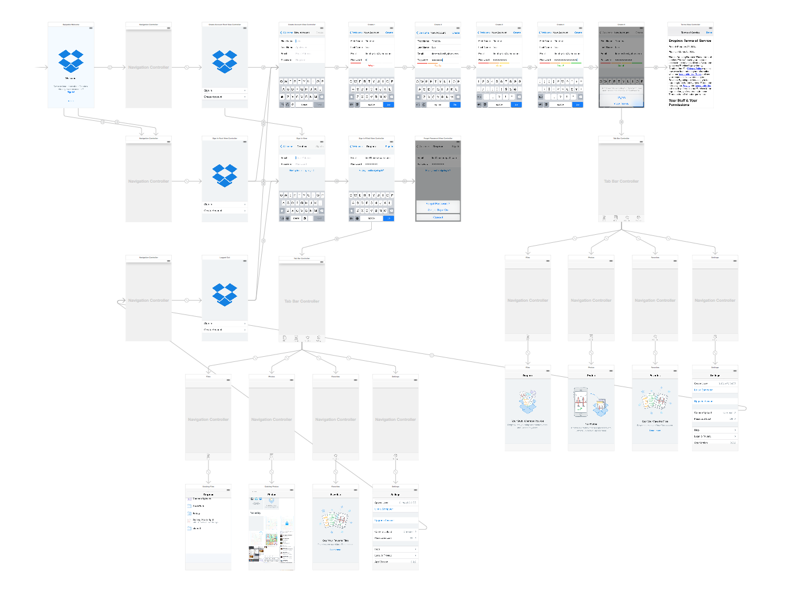
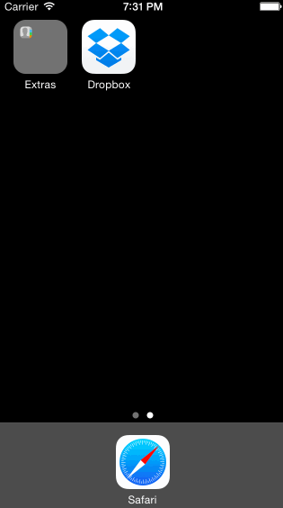

# Prototyping and Navigation (Dropbox)
Using Xcode to implement the flow between the screens of an application. Emulating the flow of the Dropbox app from the signed out state to the basic signed in state.

#### Time spent
8 hours spent in total

#### Completed user stories
 * ✓ User can tap through the 3 welcome screens.
 * ✓ User can follow the create user flow.
  * ✓ On the create user form, the user can tap the back button to go to the page where they can sign in or create an account.
  * ✓ Before creating the account, user can choose to read the terms of service.
  * ✓ After creating the account, user can view the placeholders for Files, Photos, and Favorites as well as the Settings screen.
  * ✓ User can log out from the Settings screen.
 * ✓ User can follow the sign in flow.
  * ✓ User can tap the area for "Having trouble signing in?"
  * ✓ User can log out from the Settings screen.
 
#### Optional tasks
~~ * Optional: Add a detail view for one of the files and implement favoriting the file.
~~
~~ * Optional: Add UITextFields for the forms so you can actually type in them and handle dismissing the keyboard.
~~ * ✓ Optional: You should be able to swipe through the welcome screens instead of just tapping them.

#### Notes
##### Swipe Gestures
**Michelle Harvey**'s method of using `UIScrollView` to handle swipe gestures on the Welcome screens was invaluable. (She has a great description on the CodePath iOS for Designers Facebook group.) I spent some time trying to implement transitions across each welcome screen with View `Controllers`, `modals`, and `swipe gesture regonizer`. Embedding all the screens as `Views` rather than `View Controllers` is much more efficient for prototyping.

I wasn't able to get the snippet she recommended to work, however. 

`scrollView.contentSize = CGSize(width: 960, height: scrollView.bounds.size.height)
`

Instead of the `scrollView` calculating the height of the nested `views`, I manually entered the dimensions in `WelcomeSwipeViewController.swift`.

`welcomeScrollView.contentSize = CGSize(width: 960, height: 568)`

##### Modal and Push
TL;DR: This assignment, more than the class or lab, forced me to understand the difference between modal and push transitions. 

Early on, my storyboard used modals almost exclusively. When I started using navigation conrollers and married code with my storyboard, I spent a fair amount of time encountering errors when I attempted to pop various navigation views.

I also struggled to understand the relationship of navigation views with their children. I now see them as parents to any number of child elements beneath them, each parent with its own local memory.

I corrected this by ensuring that content used push when using navigation views.

##### Popping View Controllers
When popping view controllers, I wanted to find there a way to go back to the root view controller, which is just below the navigation controller. With **Tim Lee**'s guidance, I was able to modify the code that allows us to go back one-level:
       `navigationController!.popViewControllerAnimated(true)` 
        
And travel back to the root navigation controller:
`navigationController!.popToRootViewControllerAnimated(true)`

##### Welcome Screen Auto Segues
The assignment instructed us to make two welcome screens, each with a segue that automatically triggers to bypass the welcome screen deliver the user to either the login flow or the create an account flow. The task also asked that users be able to sign-out on the settings screen of either of those flows.

Because there were so many paths to the two welcome screens, and since there was no logic in place to detect whether a auto segue was fired, I created a third without segues. This would ensure users were delivered to a screen, regardless of their path, and have an opportunity to select create an account or sign in.

### Walkthrough of all user stories

GIF created with [LiceCap](http://www.cockos.com/licecap/).
